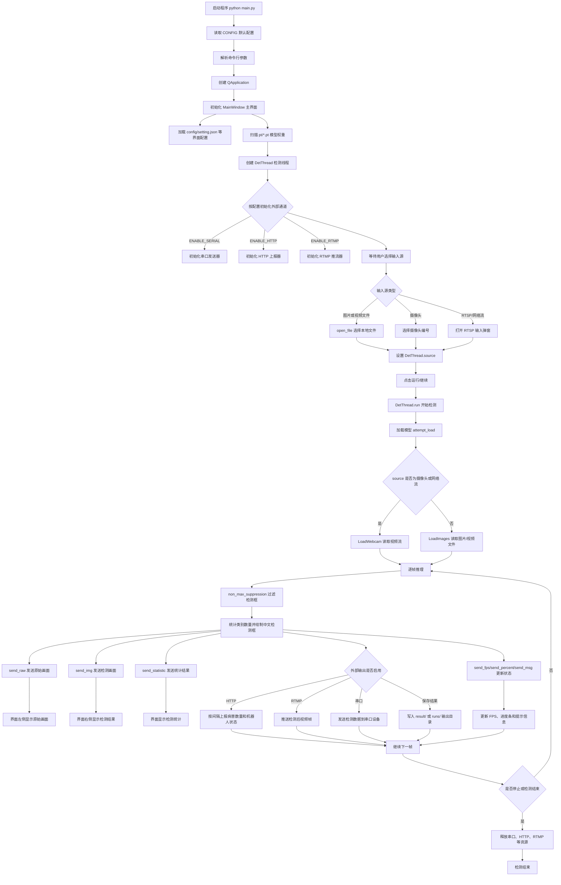
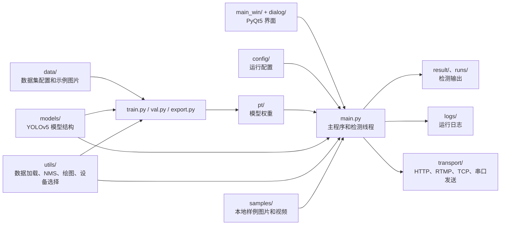
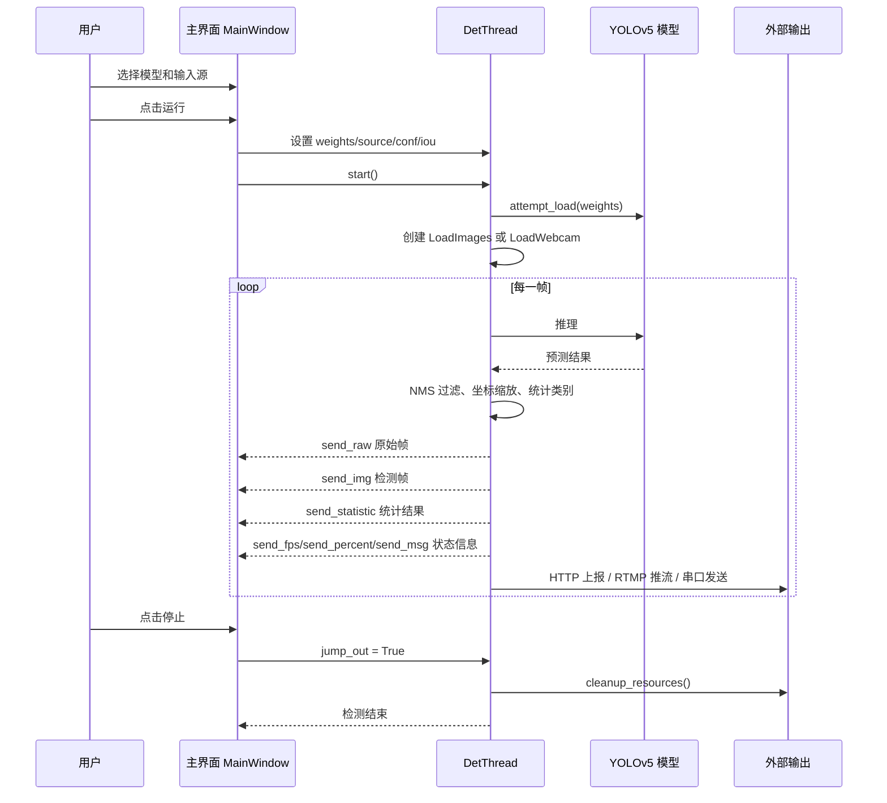

# 系统流程图

## 总体运行流程

```mermaid
flowchart TD
    A["启动程序 python main.py"] --> B["读取 CONFIG 默认配置"]
    B --> C["解析命令行参数"]
    C --> D["创建 QApplication"]
    D --> E["初始化 MainWindow 主界面"]

    E --> F["加载 config/setting.json 等界面配置"]
    E --> G["扫描 pt/*.pt 模型权重"]
    G --> H["创建 DetThread 检测线程"]

    H --> I{"按配置初始化外部通道"}
    I -->|ENABLE_SERIAL| J["初始化串口发送器"]
    I -->|ENABLE_HTTP| K["初始化 HTTP 上报器"]
    I -->|ENABLE_RTMP| L["初始化 RTMP 推流器"]
    I --> M["等待用户选择输入源"]

    M --> N{"输入源类型"}
    N -->|图片或视频文件| O["open_file 选择本地文件"]
    N -->|摄像头| P["选择摄像头编号"]
    N -->|RTSP/网络流| Q["打开 RTSP 输入弹窗"]

    O --> R["设置 DetThread.source"]
    P --> R
    Q --> R
    R --> S["点击运行/继续"]
    S --> T["DetThread.run 开始检测"]

    T --> U["加载模型 attempt_load"]
    U --> V{"source 是否为摄像头或网络流"}
    V -->|是| W["LoadWebcam 读取视频流"]
    V -->|否| X["LoadImages 读取图片/视频文件"]

    W --> Y["逐帧推理"]
    X --> Y
    Y --> Z["non_max_suppression 过滤检测框"]
    Z --> AA["统计类别数量并绘制中文检测框"]

    AA --> AB["send_raw 发送原始画面"]
    AA --> AC["send_img 发送检测画面"]
    AA --> AD["send_statistic 发送统计结果"]
    AA --> AE["send_fps/send_percent/send_msg 更新状态"]

    AB --> AF["界面左侧显示原始画面"]
    AC --> AG["界面右侧显示检测结果"]
    AD --> AH["界面显示检测统计"]
    AE --> AI["更新 FPS、进度条和提示信息"]

    AA --> AJ{"外部输出是否启用"}
    AJ -->|HTTP| AK["按间隔上报病害数量和机器人状态"]
    AJ -->|RTMP| AL["推送检测后视频帧"]
    AJ -->|串口| AM["发送检测数据到串口设备"]
    AJ -->|保存结果| AN["写入 result/ 或 runs/ 输出目录"]

    AK --> AO["继续下一帧"]
    AL --> AO
    AM --> AO
    AN --> AO
    AI --> AO
    AO --> AP{"是否停止或检测结束"}
    AP -->|否| Y
    AP -->|是| AQ["释放串口、HTTP、RTMP 等资源"]
    AQ --> AR["检测结束"]
```

## 模块关系图

```mermaid
flowchart LR
    UI["main_win/ + dialog/\nPyQt5 界面"] --> Main["main.py\n主程序和检测线程"]
    Config["config/\n运行配置"] --> Main
    Weights["pt/\n模型权重"] --> Main
    Model["models/\nYOLOv5 模型结构"] --> Main
    Utils["utils/\n数据加载、NMS、绘图、设备选择"] --> Main

    Main --> Result["result/、runs/\n检测输出"]
    Main --> Log["logs/\n运行日志"]
    Main --> Transport["transport/\nHTTP、RTMP、TCP、串口发送"]

    Data["data/\n数据集配置和示例图片"] --> Train["train.py / val.py / export.py"]
    Model --> Train
    Utils --> Train
    Train --> Weights

    Samples["samples/\n本地样例图片和视频"] --> Main
```

## 主检测线程内部流程

```mermaid
sequenceDiagram
    participant User as 用户
    participant UI as 主界面 MainWindow
    participant Thread as DetThread
    participant Model as YOLOv5 模型
    participant Output as 外部输出

    User->>UI: 选择模型和输入源
    User->>UI: 点击运行
    UI->>Thread: 设置 weights/source/conf/iou
    UI->>Thread: start()
    Thread->>Model: attempt_load(weights)
    Thread->>Thread: 创建 LoadImages 或 LoadWebcam

    loop 每一帧
        Thread->>Model: 推理
        Model-->>Thread: 预测结果
        Thread->>Thread: NMS 过滤、坐标缩放、统计类别
        Thread-->>UI: send_raw 原始帧
        Thread-->>UI: send_img 检测帧
        Thread-->>UI: send_statistic 统计结果
        Thread-->>UI: send_fps/send_percent/send_msg 状态信息
        Thread->>Output: HTTP 上报 / RTMP 推流 / 串口发送
    end

    User->>UI: 点击停止
    UI->>Thread: jump_out = True
    Thread->>Output: cleanup_resources()
    Thread-->>UI: 检测结束
```
